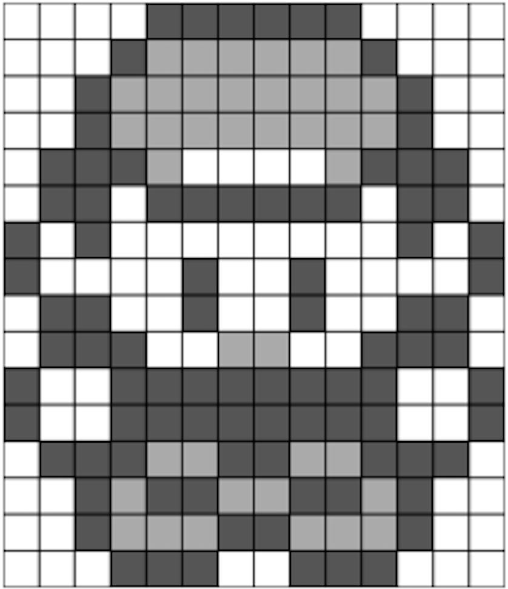

<!-- README.md is generated from README.Rmd. Please edit that file -->

```{r, include = FALSE}
knitr::opts_chunk$set(
  collapse = TRUE,
  comment = "#",
  fig.path = "man/figures/README-",
  out.width = "100%"
)

```

# pixeltrix

<!-- badges: start -->
[](https://www.repostatus.org/#concept)
[](https://github.com/matt-dray/tamRgo/actions)
[](https://app.codecov.io/gh/matt-dray/pixeltrix?branch=main)
[](https://www.rostrum.blog/2022/09/24/pixeltrix/)
<!-- badges: end -->

A simple R package that lets you select ‘pixels’ interactively from a plot window and returns your final image as a matrix, or a list of matrices that can be converted to a gif.

## How to

You can install {pixeltrix} [from GitHub](https://github.com/matt-dray/pixeltrix). You should also install [{gifski}](https://cloud.r-project.org/web/packages/gifski/index.html) if you want to make gifs.

``` r
install.packages("remotes")  # if not yet installed
remotes::install_github("matt-dray/pixeltrix")
library(pixeltrix)
```

Basic use:

1. Use `click_pixels()` to begin an interactive plot of squares ('pixels')
2. Click pixels in the plot to cycle through their states.
3. Press the <kbd>Esc</kbd> key when you're done, or the 'Finish' button in RStudio's plot window, to return a matrix that encodes your image.

You can also:

* supply a matrix output from `click_pixels()` to `edit_pixels()` so you can make changes
* draw your matrix to the plotting window as an image with `draw_pixels()`
* create a list of animation 'frames' with `frame_pixels()` and write them to a gif with `gif_pixels()`

## Examples

### Pokémon

```{r eval=FALSE}
blue <- click_pixels(14, 16, n_states = 3)  # opens an interactive plot
# Click squares in the plot window. Press <Esc> to end.
```

This is what the plot looks like when you interact with it:



You can plot the output matrix with colour.

```{r eval=FALSE}
blue_cols <- c("white", "#879afb", "gray20")
draw_pixels(blue, blue_cols)
```


<br>
<details><summary>Click for output matrix.</summary>

```{r blue}
pixeltrix::blue
```

</details>

### Mario

You can create animation frames as a list of matrices. The last frame is used as a template for the next.

```{r eval=FALSE}
mario <- frame_pixels(16, 16, n_states = 4)
# Click squares in the plot window. Press <Esc> to end.
# Add a frame? y/n: y
# Click squares in the plot window. Press <Esc> to end.
# Current frame count: 2
# Add a frame? y/n: y
# Click squares in the plot window. Press <Esc> to end.
# Current frame count: 3
# Add a frame? y/n: n
# Final frame count: 3
```

You can then convert the list to a gif.

```{r eval=FALSE}
mario_cols <- c("white", "#FDA428", "#FC0D1B", "#A32B2E")
gif_pixels(mario_frames, mario_cols, "mario.gif", delay = 0.15)
# Inserting image 3 at 0.30s (100%)...
# Encoding to gif... done!
# [1] "mario.gif"
```


<br>
<details><summary>Click for output list of matrices.</summary>

```{r mario}
pixeltrix::mario
```

</details>
