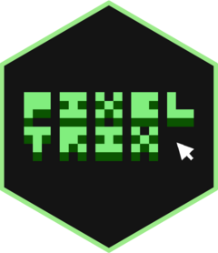
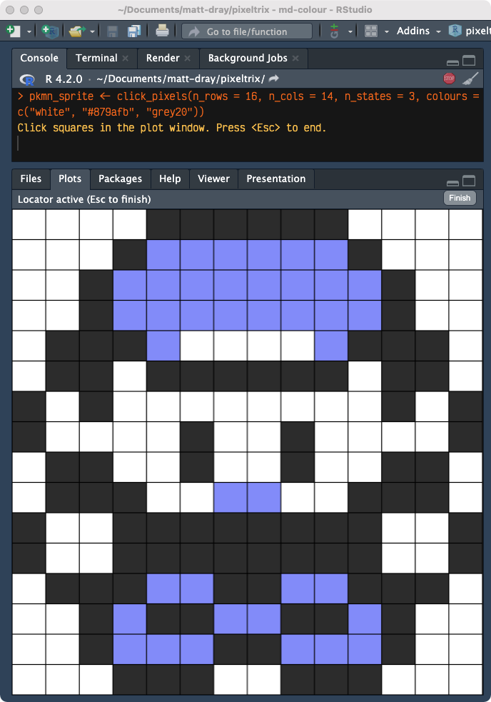
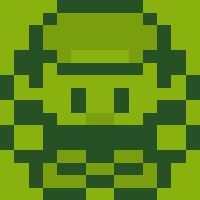
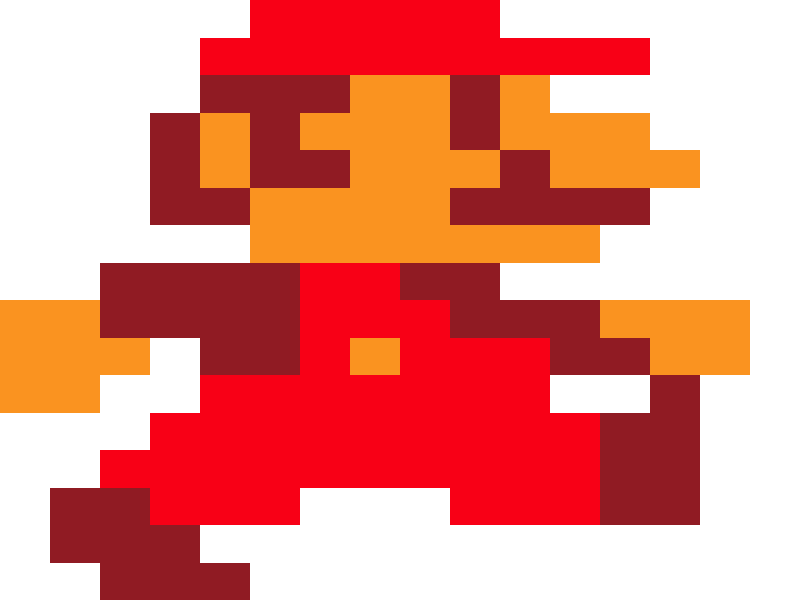

<!-- README.md is generated from README.Rmd. Please edit that file -->

```{r, include = FALSE}
knitr::opts_chunk$set(
  eval = FALSE,
  collapse = TRUE,
  comment = "#",
  fig.path = "man/figures/README-",
  out.width = "100%"
)

library(pixeltrix)
```

# pixeltrix <a href="https://github.com/matt-dray/pixeltrix"></a>

<!-- badges: start -->
[](https://www.repostatus.org/#active)
[](https://github.com/matt-dray/tamRgo/actions)
[](https://app.codecov.io/gh/matt-dray/pixeltrix?branch=main)
[](https://github.com/matt-dray/pixeltrix/actions/workflows/air-format.yaml)
[![Blog posts](https://img.shields.io/badge/rostrum.blog-black?style=flat&labelColor=00ff00&logo=data%3Aimage%2Fgif%3Bbase64%2CR0lGODdhoACgAJEAAAAAAP%2F%2F%2FwAAAAAAACH5BAlkAAIALAAAAACgAKAAAAL%2FlI%2BpywgPY5u02hQzuLz7r0nfSBohVKbqdT7rS7UbTMNyjR93zoNtX9sBh7EfcSU8Kh3GJSnpVEKjnCkVaL0WT1pps2vJgr1cp3gMPufU6Cs7%2BG233zS6nByK2u%2FEPTLO1%2BWnMhi4BjhUaAhXtqS4aIOIJQmJpvhYqXVJmbm42dgZ%2BpkXWjqqUWrKOYGZioc60urat9ogOzsJ2nGLy3Oa0VtVy3AmUzy8wMuCrHBsTErMjCH9pytszfQMG40dRk34bcKpDZ0cLqDs3V3hTI5ie57OHj%2FuLsJdvnv%2BRL%2BObv8O3zYP8rbku3YwG0BW%2FRLmcjjPH8CA5vwxtIjj172K%2FwvhYRQITE67gc0mzgC5seRHS%2FUkmrwI8d%2FKMSNDotQGk%2BS0mWlaxjR5kqNOhUMN1Uy5s%2BNNFx5j3jlKUaVSoTapIvXks6i4iTmrStXKByrTpca6XtWxz0xWr0ntmY3ali1Wl3SnfpWLlqeghkDdxkrriG9fcvz0ahI8%2BFlhpyIRJ9YIdy5jso%2FBvh2bCXLlyVYjG3W82XJT0XNAhz4bkTNN06cx6zPshnXrxaQzv1TLNZg6u7Ry6zboN7Dv36Pd6blNvDhh3LyTEzXOPLjzu8uFN58u83oPoNg7K44Ovfvz6q%2FCi0%2FRuuz5w%2Blhr6%2FWvvZ7RvHxzn9Y3%2FP97fnt7%2F8%2F1J9%2B%2F2UUoIAD1lGgawf6kmBQ54mlHmVrkUedgQTWJV2F30mIoX8A%2FoScdxGKCOFxHVIYF4rj4aSchfSBxV2LG5I4oYsInsgihyAOp6GDve2oXXYZppijiCYCOeSKM%2FZYInioCWkekzUuSaSCiUw5opQ4Uqmkj3tt6WVeQTbZCZk0gnlZmIGYqSWS%2FhX0IYxYslmlmmFhmSadXaqCpoxZ1pkmn24%2BGSNZgYqCp596iilfT33qKOejtknaZqSD2hgMhIsuaKSiiXKamqVJMuohqFtdyiWpT5p6qqhRAsrqoZC%2BCdh6mn4aa6ezElrrg3PimiusuwoIJ6I81nmre4L%2Fjtrqq10WW9qxz%2F6qrLFjhlhpqb8Veiaqf3bHbba8SotduMhSq1ov5k4LJrQskdusiqoW6Su8UMobL73qAnsupcJO6m2e%2FO5pravjXuuvZAYTi%2B2%2FPS5La7sDz2vlZwlT%2FC3GsgK8cMX5pvqxne5GcnHIm96LqaMBe1oyyh7f2fK6GvsJ8cEdZxzyxpWcLHPONBccsbc89%2FrjzQLHTPSVSNt78lMTm%2Fy0y3Y6vTTCK5cZdc9S6wzJ0ExHTfXV3Rr9c7TpEjzsy5pNfeHZM6ctsmlHNor22EHT%2FXZ5q5Ztt83a6qp3ynWLy7B7IzuM0M1N833E2keL%2FZrb6MnNMuSJPv9NsuRbV062D9V6rnmyli%2FzOceYIx7s5IYnnbrjqWeOt8%2Bvwxf75rODs3rpt7t%2Bu%2Bqhsx4s773TdvrgkBQAADs%3D)](https://www.rostrum.blog/posts/2024-09-15-shiny-pixel/)
<!-- badges: end -->

Create static and animated pixel art from an interactive plot window in R. Returns your image's 'blueprint' as a matrix. Pixel + matrix = {pixeltrix}.

## How to

You can install {pixeltrix} [from GitHub](https://github.com/matt-dray/pixeltrix). It has no dependencies unless you want to make gifs, which requires you to install [{gifski}](https://cloud.r-project.org/web/packages/gifski/index.html).

```{r eval=FALSE}
install.packages("remotes")  # if not yet installed
remotes::install_github("matt-dray/pixeltrix")
library(pixeltrix)
```

Basic use:

1. Use `click_pixels()` to begin an interactive, clickable plot of squares ('pixels').
2. Click individual pixels repetitively to cycle through their states.
3. Press the <kbd>Esc</kbd> key when you're done, or the 'Finish' button in RStudio's plot window, to return a matrix that encodes your image.

You can also:

* draw your matrix to the plotting window as an image with `draw_pixels()`
* make changes by passing the matrix output from `click_pixels()` into `edit_pixels()`
* create animation frames (a list of matrices) with `frame_pixels()` and write them to a gif with `gif_pixels()`

## Limitations

This package does what I need it to do; it doesn't match the quality of a real pixel art editor. Some known limitations are that:

* you can only click one pixel at a time
* each click only increments the pixel state by 1
* you can't change the number of pixel states on the fly, nor the colour palette

If your editor opens a separate graphics window (i.e. not RStudio), each click may result in a brief flash as the image refreshes, while a resized window may return to its original dimensions. You may also hear a bell sound on click, which you can disable by setting `options(locatorBell = FALSE)`.

The package isn't fully tested on all platforms and integrated development environments.
Please [leave an issue](https://github.com/matt-drray/pixeltrix) or raise a pull request if you find any bugs.

## Examples

### Static sprite

Let's create a sprite of the player character from _Pokémon_ (1996) using `click_pixels()`:

```{r}
pkmn_sprite <- click_pixels(
  n_rows   = 16,
  n_cols   = 14,
  n_states = 3,  # number of states that a pixel can take
  colours  = c("white", "#879afb", "grey20")  # Pokémon Blue palette
)
# Click squares in the plot window. Press <Esc> to end.
```

This opens an interactive plot window. You can click to cycle the pixels through each of the three states. Here's how the finished version looks in RStudio:



A matrix is returned when you've finished clicking and pressed <kbd>Esc</kbd>. Note that the values are zero-indexed and the corresponding colour palette is stored in a `colours` attribute. The object also gets the class 'pixeltrix'.

```{r eval=TRUE}
str(pkmn_sprite)

is_pixeltrix(pkmn_sprite)
```

The `pkmn_sprite` object is built-in to {pixeltrix} for demo purposes.

You can pass the 'pixeltrix' object to `edit_pixels()` to reopen the interactive plotting window to make adjustments. You can also increase `n_states` or change the colour palette. You could also create a matrix 'by hand' and use `as_pixeltrix()` to coerce it to a 'pixeltrix' object with a greyscale palette.

The `draw_pixels()` function simply plots your matrix, optionally with a new colour palette:

```{r eval=FALSE}
draw_pixels(
  m = pkmn_sprite,
  colours = c("#9bbc0f", "#8bac0f", "#306230")  # Game Boy palette
)
```



### Animated sprite

You can create multiple animation frames with `frame_pixels()`. The prior frame is used as a template for the next.

Here's how it might look to recreate Mario's walk cycle from _Super Mario Brothers_ (1983), including an interactive prompt to add more frames as required:

```{r}
mario_frames <- frame_pixels(
  n_rows   = 16,
  n_cols   = 16,
  n_states = 4,
  colours  = c("#8861FE", "#F6B95B", "#EF151A", "#7F6D14")
)
# Click squares in the plot window. Press <Esc> to end.
# Add a frame? y/n: y
# Click squares in the plot window. Press <Esc> to end.
# Current frame count: 2
# Add a frame? y/n: y
# Click squares in the plot window. Press <Esc> to end.
# Current frame count: 3
# Add a frame? y/n: n
# Final frame count: 3
```

The structure of the object is a list of matrices, where each matrix is a frame of the animation. This object is provided in {pixeltrix} as a demo dataset.

```{r eval=TRUE}
str(mario_frames)
```

You can then convert the frames to a gif with `gif_pixels()`.

```{r}
gif_pixels(
  frames  = mario_frames, 
  file    = "mario.gif",  # write location
  delay   = 0.15  # passed to gifski::save_gif()
)
# Inserting image 3 at 0.30s (100%)...
# Encoding to gif... done!
# [1] "mario.gif"
```

Which results in this:


