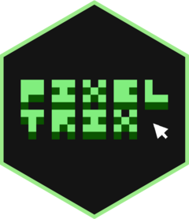
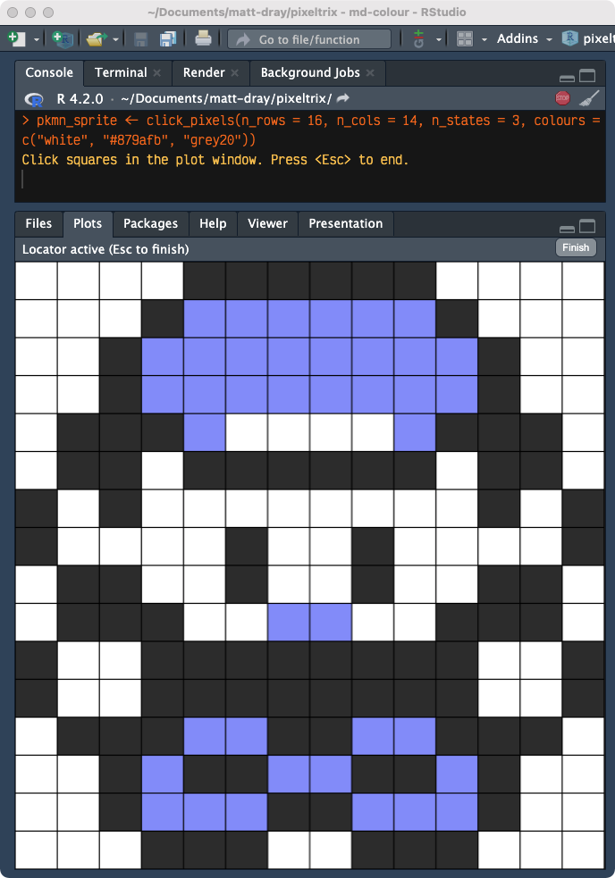
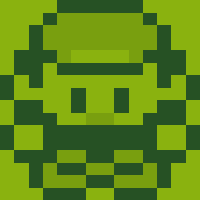
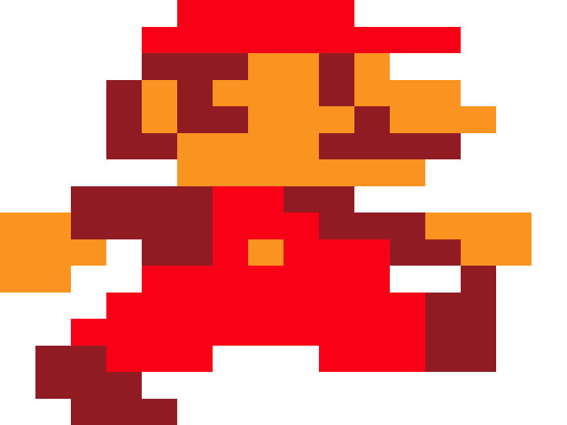

<!-- README.md is generated from README.Rmd. Please edit that file -->

# pixeltrix <a href="https://github.com/matt-dray/pixeltrix"></a>

<!-- badges: start -->

[](https://www.repostatus.org/#concept)
[](https://github.com/matt-dray/tamRgo/actions)
[](https://app.codecov.io/gh/matt-dray/pixeltrix?branch=main)
[]([https://www.rostrum.blog/tags/pixeltrix/](https://www.rostrum.blog/index.html#category=pixeltrix))
<!-- badges: end -->

Create static and animated pixel art from an interactive plot window in
R. Returns your image’s ‘blueprint’ as a matrix. Pixel + matrix =
{pixeltrix}.

## How to

You can install {pixeltrix} [from
GitHub](https://github.com/matt-dray/pixeltrix). It has no dependencies
unless you want to make gifs, which requires you to install
[{gifski}](https://cloud.r-project.org/web/packages/gifski/index.html).

``` r
install.packages("remotes")  # if not yet installed
remotes::install_github("matt-dray/pixeltrix")
library(pixeltrix)
```

Basic use:

1.  Use `click_pixels()` to begin an interactive, clickable plot of
    squares (‘pixels’).
2.  Click individual pixels repetitively to cycle through their states.
3.  Press the <kbd>Esc</kbd> key when you’re done, or the ‘Finish’
    button in RStudio’s plot window, to return a matrix that encodes
    your image.

You can also:

- draw your matrix to the plotting window as an image with
  `draw_pixels()`
- make changes by passing the matrix output from `click_pixels()` into
  `edit_pixels()`
- create animation frames (a list of matrices) with `frame_pixels()` and
  write them to a gif with `gif_pixels()`

## Limitations

This package does what I need it to do; it doesn’t match the quality of
a real pixel art editor. Some known limitations are that:

- you can only click one pixel at a time
- each click only increments the pixel state by 1
- you can’t change the number of pixel states on the fly, nor the colour
  palette

If your editor opens a separate graphics window (i.e. not RStudio), each
click may result in a brief flash as the image refreshes, while a
resized window may return to its original dimensions. You may also hear
a bell sound on click, which you can disable by setting
`options(locatorBell = FALSE)`.

## Examples

### Static sprite

Let’s create a sprite of the player character from *Pokémon* (1996)
using `click_pixels()`:

``` r
pkmn_sprite <- click_pixels(
  n_rows   = 16,
  n_cols   = 14,
  n_states = 3,  # number of states that a pixel can take
  colours  = c("white", "#879afb", "grey20")  # Pokémon Blue palette
)
# Click squares in the plot window. Press <Esc> to end.
```

This opens an interactive plot window. You can click to cycle the pixels
through each of the three states. Here’s how that looks in RStudio:



A matrix is returned when you’ve finished clicking and pressed
<kbd>Esc</kbd>. Note that the values are zero-indexed and the
corresponding colour palette is stored in a `colours` attribute.

``` r
str(pkmn_sprite)
#  int [1:16, 1:14] 0 0 0 0 0 0 2 2 0 0 ...
#  - attr(*, "colours")= Named chr [1:3] "white" "#879afb" "grey20"
#   ..- attr(*, "names")= chr [1:3] "0" "1" "2"
```

You can pass the matrix to `edit_pixels()` to reopen the interactive
plotting window to make adjustments. You can also increase `n_states` or
change the colour palette.

The `draw_pixels()` function simply plots your matrix, optionally with a
new colour palette:

``` r
draw_pixels(
  m = pkmn_sprite,
  colours = c("#9bbc0f", "#8bac0f", "#306230")  # Game Boy palette
)
```



### Animated sprite

You can create multiple animation frames with `frame_pixels()`. The
prior frame is used as a template for the next.

Here’s how it might look to recreate Mario’s walk cycle from *Super
Mario Brothers* (1983), including an interactive prompt to add more
frames as required:

``` r
mario_frames <- frame_pixels(
  n_rows   = 16,
  n_cols   = 16,
  n_states = 4,
  colours  = c("#8861FE", "#F6B95B", "#EF151A", "#7F6D14")
)
# Click squares in the plot window. Press <Esc> to end.
# Add a frame? y/n: y
# Click squares in the plot window. Press <Esc> to end.
# Current frame count: 2
# Add a frame? y/n: y
# Click squares in the plot window. Press <Esc> to end.
# Current frame count: 3
# Add a frame? y/n: n
# Final frame count: 3
```

The structure of the object is a list of matrices, where each matrix is
a frame of the animation.

``` r
str(mario_frames)
# List of 3
#  $ : int [1:16, 1:16] 0 0 0 0 0 0 0 0 1 1 ...
#   ..- attr(*, "colours")= Named chr [1:4] "#8861FE" "#F6B95B" "#EF151A" "#7F6D14"
#   .. ..- attr(*, "names")= chr [1:4] "0" "1" "2" "3"
#  $ : int [1:16, 1:16] 0 0 0 0 0 0 0 0 0 0 ...
#   ..- attr(*, "colours")= Named chr [1:4] "#8861FE" "#F6B95B" "#EF151A" "#7F6D14"
#   .. ..- attr(*, "names")= chr [1:4] "0" "1" "2" "3"
#  $ : int [1:16, 1:16] 0 0 0 0 0 0 0 0 0 0 ...
#   ..- attr(*, "colours")= Named chr [1:4] "#8861FE" "#F6B95B" "#EF151A" "#7F6D14"
#   .. ..- attr(*, "names")= chr [1:4] "0" "1" "2" "3"
```

You can then convert the frames to a gif with `gif_pixels()`.

``` r
gif_pixels(
  frames  = mario_frames, 
  file    = "mario.gif",  # write location
  delay   = 0.15  # passed to gifski::save_gif()
)
# Inserting image 3 at 0.30s (100%)...
# Encoding to gif... done!
# [1] "mario.gif"
```

Which results in this:


