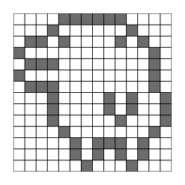
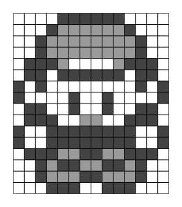

# {pixeltrix}

<!-- badges: start -->
[](https://www.repostatus.org/#concept)
[](https://github.com/matt-dray/tamRgo/actions)
[](https://app.codecov.io/gh/matt-dray/pixeltrix?branch=main)
[](https://www.rostrum.blog/2022/09/24/pixeltrix/)
<!-- badges: end -->

A simple R package that lets you select ‘pixels’ interactively from a plot window and returns your final image as a matrix, or a list of matrices that can be converted to a gif.

## How to

You can install {pixeltrix} [from GitHub](https://github.com/matt-dray/pixeltrix). You should also install [{gifski}](https://cloud.r-project.org/web/packages/gifski/index.html) if you want to make gifs.

``` r
install.packages("remotes")  # if not yet installed
remotes::install_github("matt-dray/pixeltrix")
library(pixeltrix)
```

Basic use:

1. Use `click_pixels()` to begin an interactive plot of squares ('pixels')
2. Click pixels in the plot to cycle through their states.
3. Press the <kbd>Esc</kbd> key when you're done, or the 'Finish' button in RStudio's plot window, to return a matrix that encodes your image.

You can also:

* supply a matrix output from `click_pixels()` to `edit_pixels()` so you can make changes
* draw your matrix to the plotting window as an image with `draw_pixels()`
* create a list of animation 'frames' with `frame_pixels()` and write them to a gif with `gif_pixels()`

## Examples

### Tamagotchi

``` r
click_pixels(n_row = 14, n_col = 14) -> tam_sprite
```



<details><summary>Click to expand the output matrix.</summary>

``` r
tam_sprite
#       [,1] [,2] [,3] [,4] [,5] [,6] [,7] [,8] [,9] [,10] [,11] [,12] [,13] [,14]
#  [1,]    0    0    0    0    1    1    1    1    1     1     0     0     0     0
#  [2,]    0    0    0    1    0    0    0    0    0     0     1     0     0     0
#  [3,]    0    1    1    0    1    0    0    0    0     1     0     1     0     0
#  [4,]    1    0    0    0    0    0    0    0    0     0     0     0     1     0
#  [5,]    0    1    1    1    0    0    0    0    0     0     0     0     1     0
#  [6,]    1    0    0    0    0    0    0    0    0     0     0     0     1     0
#  [7,]    0    1    1    1    0    0    0    0    0     0     0     0     1     0
#  [8,]    0    0    0    1    0    0    0    0    1     0     1     0     0     1
#  [9,]    0    0    0    1    0    0    0    0    1     0     1     0     0     1
# [10,]    0    0    0    1    0    0    0    0    0     1     0     0     0     1
# [11,]    0    0    0    0    1    0    0    0    0     0     0     0     1     0
# [12,]    0    0    0    0    0    1    0    1    1     1     0     1     0     0
# [13,]    0    0    0    0    0    1    0    1    0     1     0     1     0     0
# [14,]    0    0    0    0    0    0    1    0    0     0     1     0     0     0
```

</details>

### Pokémon

``` r
click_pixels(14, 16, n_states = 3) -> poke_sprite
```



<details><summary>Click to expand the output matrix.</summary>

``` r
poke_sprite
#       [,1] [,2] [,3] [,4] [,5] [,6] [,7] [,8] [,9] [,10] [,11] [,12] [,13] [,14]
#  [1,]    0    0    0    0    2    2    2    2    2     2     0     0     0     0
#  [2,]    0    0    0    2    1    1    1    1    1     1     2     0     0     0
#  [3,]    0    0    2    1    1    1    1    1    1     1     1     2     0     0
#  [4,]    0    0    2    1    1    1    1    1    1     1     1     2     0     0
#  [5,]    0    2    2    2    1    0    0    0    0     1     2     2     2     0
#  [6,]    0    2    2    0    2    2    2    2    2     2     0     2     2     0
#  [7,]    2    0    2    0    0    0    0    0    0     0     0     2     0     2
#  [8,]    2    0    0    0    0    2    0    0    2     0     0     0     0     2
#  [9,]    0    2    2    0    0    2    0    0    2     0     0     2     2     0
# [10,]    0    2    2    2    0    0    1    1    0     0     2     2     2     0
# [11,]    2    0    0    2    2    2    2    2    2     2     2     0     0     2
# [12,]    2    0    0    2    2    2    2    2    2     2     2     0     0     2
# [13,]    0    2    2    2    1    1    2    2    1     1     2     2     2     0
# [14,]    0    0    2    1    2    2    1    1    2     2     1     2     0     0
# [15,]    0    0    2    1    1    1    2    2    1     1     1     2     0     0
# [16,]    0    0    0    2    2    2    0    0    2     2     2     0     0     0
```

</details>
