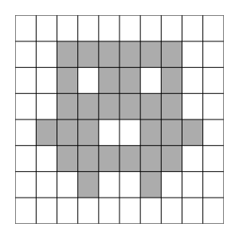

# {pixeltrix}

<!-- badges: start -->
[](https://www.repostatus.org/#concept)
[](https://github.com/matt-dray/tamRgo/actions)
[](https://app.codecov.io/gh/matt-dray/pixeltrix?branch=main)
<!-- badges: end -->

A simple work-in-progress R package for interactive pixel art in the plot window.

1. Provide dimensions for a pixel-plotting canvas.
2. It will be plotted as an interactive image.
3. Click pixels to convert them from 'off' to 'on' and vice versa.
4. Press <kbd>Esc</kbd> when you're done.
5. A matrix is returned that encodes your pixel art.
6. ???
7. Profit.

You can install it from GitHub:

``` r
install.packages("remotes")  # if not yet installed
remotes::install_github("matt-dray/pixeltrix")
```

Begin the interactive plot with `click_pixels()`. You can set the number of rows and columns of pixels in the plot, set the number of pixel states (defaults to binary) and choose to turn off the grid overlay.

``` r
click_pixels(n_row = 8, n_col = 10) -> m
```

Click individual pixels in the plot to cycle through their states (lightest to darkest). If `n_states = 2` (default), then the pixels are 'off' (0, white) or 'on' (1, grey). Design a little character or something.



Hit <kbd>Esc</kbd> to finish and you'll get a matrix back that represents your image.

```
m
#      [,1] [,2] [,3] [,4] [,5] [,6] [,7] [,8] [,9] [,10]
# [1,]    0    0    0    0    0    0    0    0    0     0
# [2,]    0    0    1    1    1    1    1    1    0     0
# [3,]    0    0    1    0    1    1    0    1    0     0
# [4,]    0    1    1    1    1    1    1    1    1     0
# [5,]    0    0    1    1    0    0    1    1    0     0
# [6,]    0    0    1    1    1    1    1    1    0     0
# [7,]    0    0    0    1    0    0    1    0    0     0
# [8,]    0    0    0    0    0    0    0    0    0     0
```

Why? I have [my reasons](https://github.com/matt-dray/tamRgo/).
