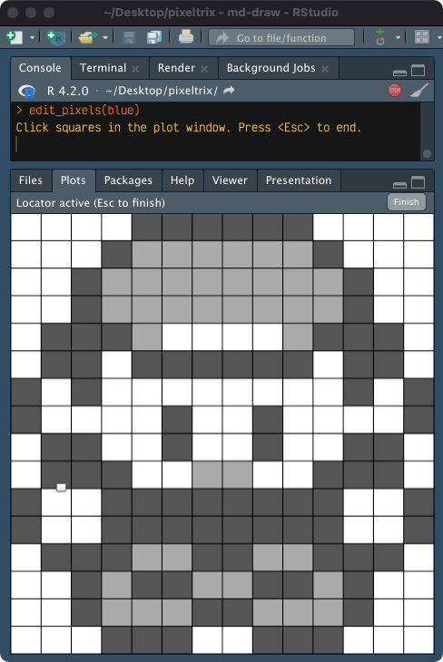
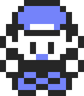

<!-- README.md is generated from README.Rmd. Please edit that file -->

# pixeltrix

<!-- badges: start -->

[](https://www.repostatus.org/#concept)
[](https://github.com/matt-dray/tamRgo/actions)
[](https://app.codecov.io/gh/matt-dray/pixeltrix?branch=main)
[](https://www.rostrum.blog/tags/pixeltrix/)
<!-- badges: end -->

A simple R package that lets you select ‘pixels’ interactively from a
plot window and returns your final image as a matrix, or a list of
matrices that can be converted to a gif.

## How to

You can install {pixeltrix} [from
GitHub](https://github.com/matt-dray/pixeltrix). You should also install
[{gifski}](https://cloud.r-project.org/web/packages/gifski/index.html)
if you want to make gifs.

``` r
install.packages("remotes")  # if not yet installed
remotes::install_github("matt-dray/pixeltrix")
library(pixeltrix)
```

Basic use:

1.  Use `click_pixels()` to begin an interactive plot of squares
    (‘pixels’)
2.  Click pixels in the plot to cycle through their states.
3.  Press the <kbd>Esc</kbd> key when you’re done, or the ‘Finish’
    button in RStudio’s plot window, to return a matrix that encodes
    your image.

You can also:

- supply a matrix output from `click_pixels()` to `edit_pixels()` so you
  can make changes
- draw your matrix to the plotting window as an image with
  `draw_pixels()`
- create a list of animation ‘frames’ with `frame_pixels()` and write
  them to a gif with `gif_pixels()`

## Examples

### One frame

To a create a sprite in a single frame, use `click_pixels()`.

``` r
blue <- click_pixels(14, 16, n_states = 3)  # opens an interactive plot
# Click squares in the plot window. Press <Esc> to end.
```

This opens an interactive, clickable plot. Here’s how that looks in
RStudio.



A matrix is returned when you’re finished.

<details>
<summary>
Click for matrix.
</summary>

``` r
pixeltrix::blue  # # made available in the package
#       [,1] [,2] [,3] [,4] [,5] [,6] [,7] [,8] [,9] [,10] [,11] [,12] [,13]
#  [1,]    0    0    0    0    2    2    2    2    2     2     0     0     0
#  [2,]    0    0    0    2    1    1    1    1    1     1     2     0     0
#  [3,]    0    0    2    1    1    1    1    1    1     1     1     2     0
#  [4,]    0    0    2    1    1    1    1    1    1     1     1     2     0
#  [5,]    0    2    2    2    1    0    0    0    0     1     2     2     2
#  [6,]    0    2    2    0    2    2    2    2    2     2     0     2     2
#  [7,]    2    0    2    0    0    0    0    0    0     0     0     2     0
#  [8,]    2    0    0    0    0    2    0    0    2     0     0     0     0
#  [9,]    0    2    2    0    0    2    0    0    2     0     0     2     2
# [10,]    0    2    2    2    0    0    1    1    0     0     2     2     2
# [11,]    2    0    0    2    2    2    2    2    2     2     2     0     0
# [12,]    2    0    0    2    2    2    2    2    2     2     2     0     0
# [13,]    0    2    2    2    1    1    2    2    1     1     2     2     2
# [14,]    0    0    2    1    2    2    1    1    2     2     1     2     0
# [15,]    0    0    2    1    1    1    2    2    1     1     1     2     0
# [16,]    0    0    0    2    2    2    0    0    2     2     2     0     0
#       [,14]
#  [1,]     0
#  [2,]     0
#  [3,]     0
#  [4,]     0
#  [5,]     0
#  [6,]     0
#  [7,]     2
#  [8,]     2
#  [9,]     0
# [10,]     0
# [11,]     2
# [12,]     2
# [13,]     0
# [14,]     0
# [15,]     0
# [16,]     0
```

</details>

<br>

You can plot this matrix with colour and save it as an image.

``` r
blue_cols <- c("white", "#879afb", "gray20")
draw_pixels(blue, blue_cols)
```



### Animated frames

You can create multiple animation frames as a list of matrices with
`frame_pixels()`. The last frame is used as a template for the next.

``` r
mario <- frame_pixels(16, 16, n_states = 4)
# Click squares in the plot window. Press <Esc> to end.
# Add a frame? y/n: y
# Click squares in the plot window. Press <Esc> to end.
# Current frame count: 2
# Add a frame? y/n: y
# Click squares in the plot window. Press <Esc> to end.
# Current frame count: 3
# Add a frame? y/n: n
# Final frame count: 3
```

You can then convert the list to a gif with `gif_pixels()`.

``` r
mario_cols <- c("white", "#FDA428", "#FC0D1B", "#A32B2E")
gif_pixels(mario_frames, mario_cols, "mario.gif", delay = 0.15)
# Inserting image 3 at 0.30s (100%)...
# Encoding to gif... done!
# [1] "mario.gif"
```


<details>
<summary>
Click for list of matrices.
</summary>

``` r
pixeltrix::mario  # made available in the package
# [[1]]
#       [,1] [,2] [,3] [,4] [,5] [,6] [,7] [,8] [,9] [,10] [,11] [,12] [,13]
#  [1,]    0    0    0    0    0    2    2    2    2     2     0     0     0
#  [2,]    0    0    0    0    2    2    2    2    2     2     2     2     2
#  [3,]    0    0    0    0    3    3    3    1    1     3     1     0     0
#  [4,]    0    0    0    3    1    3    1    1    1     3     1     1     1
#  [5,]    0    0    0    3    1    3    3    1    1     1     3     1     1
#  [6,]    0    0    0    3    3    1    1    1    1     3     3     3     3
#  [7,]    0    0    0    0    0    1    1    1    1     1     1     1     0
#  [8,]    0    0    3    3    3    3    2    2    3     3     0     0     0
#  [9,]    1    1    3    3    3    3    2    2    2     3     3     3     1
# [10,]    1    1    1    0    3    3    2    1    2     2     2     3     3
# [11,]    1    1    0    0    2    2    2    2    2     2     2     0     0
# [12,]    0    0    0    2    2    2    2    2    2     2     2     2     3
# [13,]    0    0    2    2    2    2    2    2    2     2     2     2     3
# [14,]    0    3    3    2    2    2    0    0    0     2     2     2     3
# [15,]    0    3    3    3    0    0    0    0    0     0     0     0     0
# [16,]    0    0    3    3    3    0    0    0    0     0     0     0     0
#       [,14] [,15] [,16]
#  [1,]     0     0     0
#  [2,]     0     0     0
#  [3,]     0     0     0
#  [4,]     0     0     0
#  [5,]     1     0     0
#  [6,]     0     0     0
#  [7,]     0     0     0
#  [8,]     0     0     0
#  [9,]     1     1     0
# [10,]     1     1     0
# [11,]     3     0     0
# [12,]     3     0     0
# [13,]     3     0     0
# [14,]     3     0     0
# [15,]     0     0     0
# [16,]     0     0     0
# 
# [[2]]
#       [,1] [,2] [,3] [,4] [,5] [,6] [,7] [,8] [,9] [,10] [,11] [,12] [,13]
#  [1,]    0    0    0    0    0    2    2    2    2     2     0     0     0
#  [2,]    0    0    0    0    2    2    2    2    2     2     2     2     2
#  [3,]    0    0    0    0    3    3    3    1    1     3     1     0     0
#  [4,]    0    0    0    3    1    3    1    1    1     3     1     1     1
#  [5,]    0    0    0    3    1    3    3    1    1     1     3     1     1
#  [6,]    0    0    0    3    3    1    1    1    1     3     3     3     3
#  [7,]    0    0    0    0    0    1    1    1    1     1     1     1     0
#  [8,]    0    0    0    0    3    3    2    3    3     3     0     0     0
#  [9,]    0    0    0    3    3    3    3    2    2     3     3     0     0
# [10,]    0    0    0    3    3    3    2    2    1     2     2     1     0
# [11,]    0    0    0    3    3    3    3    2    2     2     2     2     0
# [12,]    0    0    0    2    3    3    1    1    1     2     2     2     0
# [13,]    0    0    0    0    2    3    1    1    2     2     2     0     0
# [14,]    0    0    0    0    0    2    2    2    3     3     3     0     0
# [15,]    0    0    0    0    0    3    3    3    3     3     3     3     0
# [16,]    0    0    0    0    0    3    3    3    3     0     0     0     0
#       [,14] [,15] [,16]
#  [1,]     0     0     0
#  [2,]     0     0     0
#  [3,]     0     0     0
#  [4,]     0     0     0
#  [5,]     1     0     0
#  [6,]     0     0     0
#  [7,]     0     0     0
#  [8,]     0     0     0
#  [9,]     0     0     0
# [10,]     0     0     0
# [11,]     0     0     0
# [12,]     0     0     0
# [13,]     0     0     0
# [14,]     0     0     0
# [15,]     0     0     0
# [16,]     0     0     0
# 
# [[3]]
#       [,1] [,2] [,3] [,4] [,5] [,6] [,7] [,8] [,9] [,10] [,11] [,12] [,13]
#  [1,]    0    0    0    0    0    0    0    0    0     0     0     0     0
#  [2,]    0    0    0    0    0    0    2    2    2     2     0     0     0
#  [3,]    0    0    0    0    0    2    2    2    2     2     2     2     2
#  [4,]    0    0    0    0    0    3    3    3    1     1     3     1     0
#  [5,]    0    0    0    0    3    1    3    1    1     1     3     1     1
#  [6,]    0    0    0    0    3    1    3    3    1     1     1     3     1
#  [7,]    0    0    0    0    3    3    1    1    1     1     3     3     3
#  [8,]    0    0    0    0    0    0    1    1    1     1     1     1     1
#  [9,]    0    0    0    0    0    3    3    3    3     2     3     0     1
# [10,]    0    0    0    0    1    3    3    3    3     3     3     1     1
# [11,]    0    0    0    1    1    2    3    3    3     3     3     1     1
# [12,]    0    0    0    3    3    2    2    2    2     2     2     2     0
# [13,]    0    0    0    3    2    2    2    2    2     2     2     2     0
# [14,]    0    0    3    3    2    2    2    0    2     2     2     0     0
# [15,]    0    0    3    0    0    0    0    3    3     3     0     0     0
# [16,]    0    0    0    0    0    0    0    3    3     3     3     0     0
#       [,14] [,15] [,16]
#  [1,]     0     0     0
#  [2,]     0     0     0
#  [3,]     2     0     0
#  [4,]     0     0     0
#  [5,]     1     0     0
#  [6,]     1     1     0
#  [7,]     3     0     0
#  [8,]     0     0     0
#  [9,]     0     0     0
# [10,]     1     0     0
# [11,]     0     0     0
# [12,]     0     0     0
# [13,]     0     0     0
# [14,]     0     0     0
# [15,]     0     0     0
# [16,]     0     0     0
```

</details>
